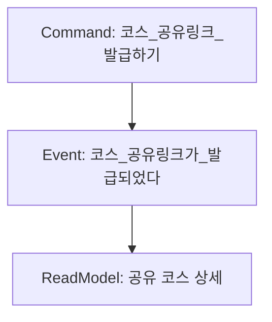
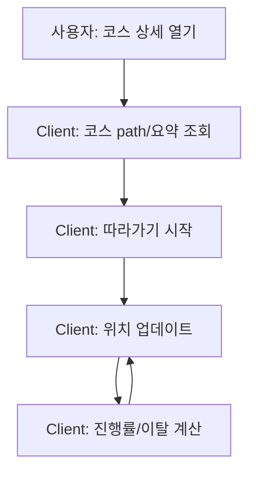

# 09_이벤트스토밍_상세

- 원본(SSOT): `설계/09_이벤트스토밍_상세.md`
- Notion 용도: 탐색/공유용(원본 변경 우선)

---

# 이벤트스토밍 상세(Commands / Events / Policies / Read Models)

- 문서 ID: EVT-STORM
- 버전: v0.1
- 작성일: 2026-02-25
- 상태: 초안

목적:

- "어떤 일이 어떤 순서로 발생하는가"를 이벤트 중심으로 고정한다.
- API/DB/백오피스/배치 작업을 설계적으로 연결한다.

참조:

- `설계/01_브레인스토밍_이벤트스토밍.md`
- `설계/08_도메인_바운디드컨텍스트.md`

표기:

- Command: 동사형(현재)
- Event: 과거형(완료)
- Policy: 이벤트 -> 커맨드 트리거 규칙
- Read Model: 화면/조회용 뷰

## 1. 워크플로 #1: 라이딩 기록 -> 코스 생성(UGC)

```mermaid
flowchart TD
  C1[Command: 라이딩_저장하기] --> E1[Event: 라이딩이_저장되었다]
  E1 --> C2[Command: 코스_생성하기(라이딩 기반)]
  C2 --> E2[Event: 코스가_생성되었다]
  E2 --> P1[Policy: 코스_메타데이터_계산하기]
  P1 --> E3[Event: 코스_메타데이터가_계산되었다]
  E2 --> RM1[ReadModel: 내 코스 목록]
  E3 --> RM2[ReadModel: 코스 상세(요약/경고/화장실 요약)]
```

핵심 규칙(불변식/정책):

- 라이딩 path는 최소 2개 좌표
- 코스 생성 시 Core 필드는 즉시 저장(title/path/visibility/sourceType)
- distance/bbox/loop는 동기 계산 가능
- amenitiesSummary(toiletCount 등)는 비동기 계산 가능

## 2. 워크플로 #2: 큐레이션 코스 등록 -> 피처드 노출

```mermaid
flowchart TD
  C1[Command: 코스_등록하기(curated)] --> E1[Event: 코스가_생성되었다]
  E1 --> C2[Command: 코스_태그_수정하기]
  C2 --> E2[Event: 코스_태그가_추가되었다]
  E1 --> C3[Command: 코스_경고_추가하기]
  C3 --> E3[Event: 코스_경고가_추가되었다]
  E1 --> P1[Policy: 코스_메타데이터_계산하기]
  P1 --> E4[Event: 코스_메타데이터가_계산되었다]
  E4 --> C4[Command: 코스_피처드_설정하기]
  C4 --> E5[Event: 코스가_피처드로_설정되었다]
  E5 --> RM1[ReadModel: 기본 제공 코스 리스트]
```

메모:

- 피처드 노출은 안전/품질 이슈가 있어 운영 통제가 필요(Backoffice)

## 3. 워크플로 #3: 코스 공유



정책:

- 기본은 unlisted 링크
- private 코스는 링크로도 접근 불가

## 4. 워크플로 #4: POI 동기화 -> 코스 메타데이터 재계산

```mermaid
flowchart TD
  C1[Command: POI_동기화_실행하기] --> E1[Event: POI_동기화가_성공했다]
  E1 --> P1[Policy: 코스_메타데이터_재계산_요청]
  P1 --> C2[Command: 코스_메타데이터_계산하기(배치)]
  C2 --> E2[Event: 코스_메타데이터가_계산되었다]
```

정책(초안):

- 전체 재계산은 비용이 크다 -> featured/최근 코스 우선
- 실패 시 코스 조회는 계속 가능(요약 일부 누락 허용)

## 5. 워크플로 #5: 코스 따라가기(레벨 2)

MVP 설계: L2는 클라이언트가 계산(진행률/이탈), 서버는 데이터 제공.



vNext 후보(서버 관측):

- `코스_따라가기_세션이_시작되었다/종료되었다` 이벤트를 서버에 기록(추천/품질에 반영)

## 6. Read Model 목록(초안)

- RM-COURSE-001: 기본 제공 코스 리스트(featured)
- RM-COURSE-002: 내 코스 목록
- RM-COURSE-003: 코스 상세(Polyline + 메타 요약 + 경고/태그)
- RM-COURSE-004: 공유 코스 상세(visibility 적용)
- RM-POI-001: 내 주변 POI 리스트
- RM-POI-002: 경로 주변 POI 리스트

## 7. 이벤트/커맨드 네이밍 규칙

- 이벤트는 "완료"를 의미하는 과거형
- 커맨드는 "의도"를 의미하는 동사형
- API는 커맨드 중심(POST/PUT)으로 설계하고, 도메인 이벤트는 내부/로그/분리 아키텍처로 활용
