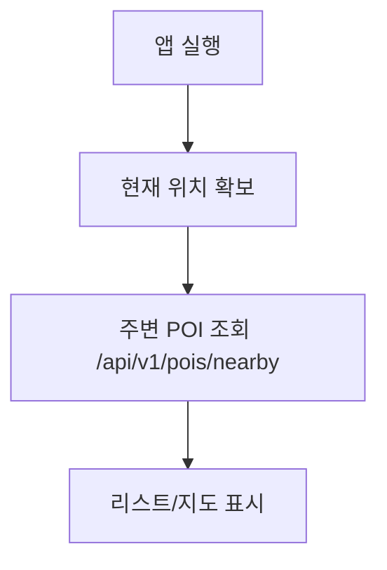
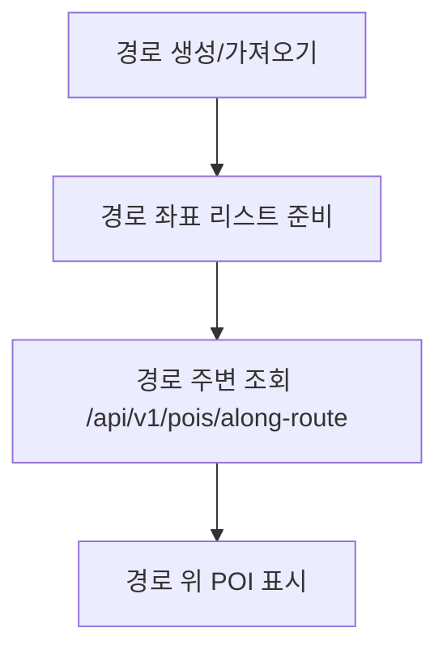
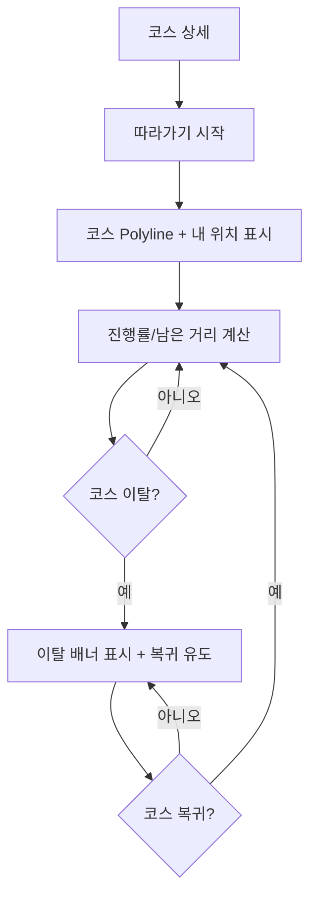
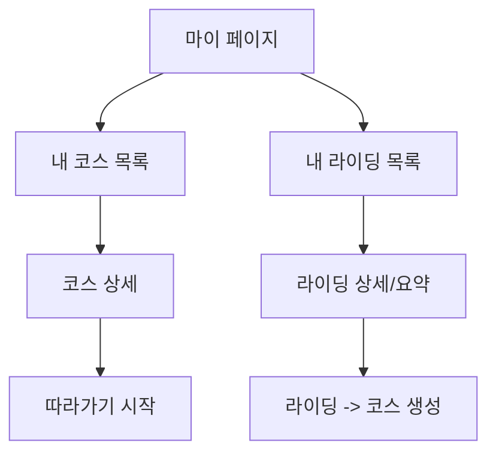

# 유저 플로우

- 버전: v0.3
- 작성일: 2026-02-25
- 상태: 초안(기본 코스/메타데이터 반영)

## 0. 홈(대시보드) - 첫 화면

"지도만 덜렁"이 아니라, 사용자가 바로 할 수 있는 행동을 먼저 제시한다.

```mermaid
flowchart TD
  A[앱 실행] --> B[홈 대시보드]
  B --> C1[피처드 코스 카드/리스트]
  B --> C2[내 주변 화장실 요약]
  B --> C3[라이딩 시작 CTA]
  B --> C4[마이 페이지(내 코스/내 라이딩)]
  C1 --> D[코스 상세]
  D --> E[따라가기 시작(레벨 2)]
  C3 --> F[라이딩 기록 화면]
  C4 --> G[내 코스 목록]
  C4 --> H[내 라이딩 목록]
```

## 1. 추천/기본 코스 보기(콜드스타트)

```mermaid
flowchart TD
  A[앱 실행] --> B[기본 제공 코스 조회]
  B --> C[코스 리스트 표시]
  C --> D[코스 선택]
  D --> E[코스 상세(경로/요약/특이사항) 표시]
  E --> F[따라가기 시작(레벨 2)]
```

## 2. 주변 POI 조회(화장실)



## 3. 경로 주변 POI 조회



## 4. 라이딩 기록 -> 코스 저장

```mermaid
flowchart TD
  A[라이딩 시작] --> B[경로 좌표 수집]
  B --> C[라이딩 종료]
  C --> D[라이딩 저장 /api/v1/ridings]
  D --> E[코스 생성 /api/v1/courses/from-riding]
  E --> F[코스 상세(경로) 표시]
```

## 5. 코스 공유 -> 공유 코스 열기

```mermaid
flowchart TD
  A[코스 상세] --> B[공유 링크 생성]
  B --> C[링크 전달]
  C --> D[상대가 링크 열기]
  D --> E[공유 코스 조회 /api/v1/courses/public/{shareId}]
  E --> F[코스 상세(경로/POI) 표시]
```

## 6. 코스 따라가기(레벨 2)



## 7. 마이페이지(내 코스/내 라이딩)



## 8. 예외 플로우

- 위치 권한 거부: 위치 업데이트/조회 불가 안내
- 네트워크 실패: 재시도/오프라인 처리(추후)
- GPS 정확도 낮음: 이탈 오탐 가능 -> 정확도 표시/알림 완화
- 백그라운드 제한: 화면 꺼짐/백그라운드에서 기록/가이드 정책을 명확히 고지
