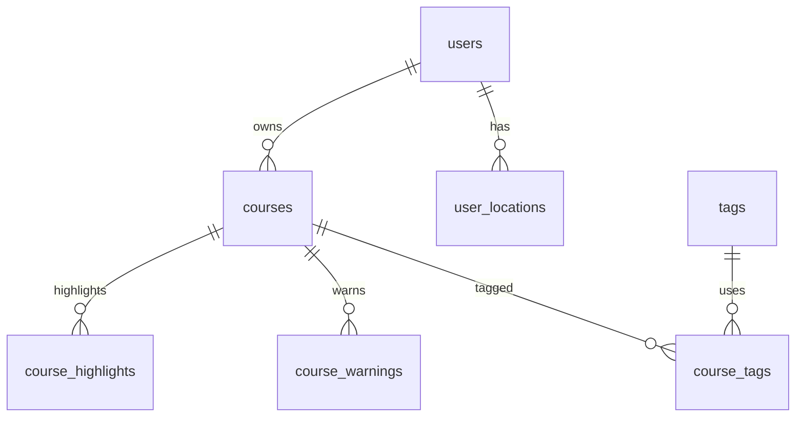

# 데이터 모델(스키마) 초안

- 문서 ID: DATA-MODEL
- 버전: v0.1
- 작성일: 2026-02-25
- 상태: 초안

목적:

- Postgres/PostGIS에서 "무엇을 어떤 형태로 저장"할지 확정한다.
- 코스 추천/요약/공유/운영이 가능한 최소 스키마를 제공한다.

참조:

- `설계/02_MVP_요구사항정의서.md` (코스 메타데이터 v1)
- `설계/08_도메인_바운디드컨텍스트.md`

## 0. 공통 규칙

- 좌표계: SRID 4326
- 좌표 순서: (lon, lat)
- 공간 인덱스: GiST

권장:

- Hibernate `ddl-auto: update` 대신 마이그레이션(Flyway) 도입(운영 안전성/재현성)

## 1. 현재(존재) 테이블 요약

> 실제 테이블명은 엔티티 어노테이션 기준. 네이티브 쿼리에서는 반드시 같은 이름을 사용해야 한다.

주의(SSOT):

- 테이블명은 엔티티 어노테이션과 네이티브 쿼리에서 반드시 일치해야 한다.
- POI는 `pois`(복수형)로 통일한다.
  - (레포 정리) 과거 네이티브 쿼리에서 `FROM poi`를 사용한 흔적이 있었고, 현재는 `FROM pois`로 정리되었다.

### 1.1 users

- id (PK)
- email (unique)
- password
- username
- created_at, updated_at

### 1.2 user_locations

- id (PK)
- user_id (FK -> users.id)
- location geometry(Point,4326)
- accuracy, speed, altitude
- metadata json
- created_at
- is_current

인덱스:

- idx_user_id_created_at (user_id, created_at desc)
- (권장) GiST(location)

### 1.3 ridings

- id (PK)
- user_id (nullable, 값만 저장)
- device_uuid (not null)
- title
- total_distance(m), total_time(sec), avg_speed(km/h)
- path_data geometry(LineString,4326)
- created_at

인덱스(권장):

- btree(device_uuid)
- btree(user_id)
- (선택) GiST(path_data) (경로 교차/검색이 필요할 때)

### 1.4 pois

- id (PK)
- name
- location geometry(Point,4326)
- address
- metadata json (opening_hours 등)
- category_id(enum string, `PoiCategory`)
- external_id (unique)
- last_synced_at
- created_at, updated_at

인덱스(권장):

- unique(external_id)
- GiST(location)
- btree(last_synced_at)

카테고리(`PoiCategory`, 현재 코드 기준):

- MVP에서 실제로 적재/조회하는 1순위는 `RESTROOM`이다.
- vNext 확장 후보: `CAFE`, `CONVENIENCE_STORE`, `PARKING`, `BIKE_SHOP` 등(약관/비용/품질 검토 후).

## 2. 신규(제안) 테이블: Course Catalog

### 2.1 courses

역할: 코스 콘텐츠(공유 가능한 경로). 추천/검색/운영의 기준.

- id (PK)
- owner_user_id (nullable)
- device_uuid (nullable)
- title (not null)
- description (nullable)
- visibility (enum: public/unlisted/private)
- source_type (enum: curated/ugc/import)
- verified_status (enum: unverified/community/curated)

- path geometry(LineString,4326) (not null)
- gpx_data text (nullable, 레거시/로컬 모드용 GPX 원문 저장)
- gpx_object_key varchar(512) (nullable, S3 오브젝트 키)

파생 메타(컬럼으로 고정; 추천/필터 핵심)

- distance_km (not null)
- estimated_duration_min (not null)
- loop (not null)
- bbox_min_lon, bbox_min_lat, bbox_max_lon, bbox_max_lat

편의 요약(초기 버전)

- toilet_count (nullable)
- cafe_count (nullable)
- toilet_max_gap_km (nullable)
- toilet_avg_gap_km (nullable)

운영/통계

- share_id (unique, nullable)
- featured_rank (nullable)
- view_count (default 0)
- follow_count (default 0)
- last_verified_at (nullable)

- created_at, updated_at

인덱스(권장)

- unique(share_id)
- btree(owner_user_id)
- btree(device_uuid)
- btree(featured_rank)
- GiST(path)

메모:

- owner_user_id vs device_uuid: 익명/회원 모두 지원하려면 둘 중 하나는 존재해야 한다(정책으로 강제).
- path(LineString)와 GPX 원문은 함께 보관/복원 가능:
  - path: 공간 질의/필터/거리 계산용
  - gpx_data: 로컬(DB 저장 모드) 및 레거시 데이터 호환용
  - gpx_object_key: 운영(S3 저장 모드)에서 GPX 원문 참조용

### 2.2 tags / course_tags

tags

- id (PK)
- key (unique, ascii 권장: river, quiet, beginner ...)
- label (표시명)
- category (예: 분위기/난이도/환경)
- is_active

course_tags

- course_id (FK)
- tag_id (FK)
- created_at

인덱스(권장)

- unique(course_id, tag_id)
- btree(tag_id)

### 2.3 course_warnings

- id (PK)
- course_id (FK)
- type (enum string)
- severity (int 1~3)
- at_location geometry(Point,4326) (nullable)
- radius_m (nullable)
- note (nullable)
- valid_until (nullable)
- created_at

인덱스(권장)

- btree(course_id)
- btree(type)
- btree(valid_until)

### 2.4 course_highlights (선택)

- id (PK)
- course_id (FK)
- type (enum: viewpoint/cafe/park/...)
- at_location geometry(Point,4326) (nullable)
- note
- created_at

## 3. ERD(개념)

## 4. 파생 메타데이터 계산(구현 힌트)

- distance_km:
  - 옵션 A: PostGIS `ST_Length(path::geography)`
  - 옵션 B: JTS로 누적 거리(정확도/성능 trade-off)
- bbox: 좌표 스캔(min/max)
- toilet_count:
  - `ST_DWithin(pois.location::geography, courses.path::geography, :radius)` count

## 5. 마이그레이션/운영

- 개발 초기에는 JPA ddl-auto로 시작해도 되지만,
  - 스키마가 고정되면 Flyway로 전환하는 것을 권장한다(추적/재현/배포 안정성).

MVP2 확장(댓글/신고):

- 커뮤니티 테이블은 `설계/18_MVP2_커뮤니티_데이터모델_스키마.md`를 따른다.

MVP3 확장(모임/참가):

- 모임/참가 테이블은 `설계/22_MVP3_모임_채팅_설계.md`를 따른다.
- 핵심 제약:
  - `course_meetup_participants`에 `unique(meetup_id, user_id)`
  - join 정합성은 row lock 기반으로 처리
