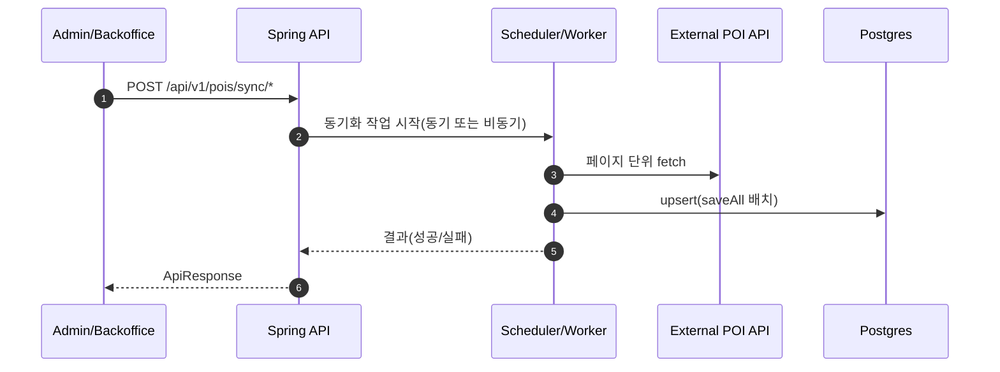
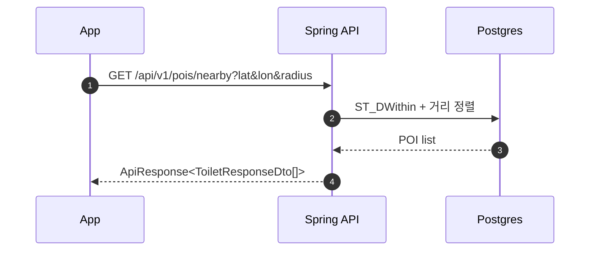
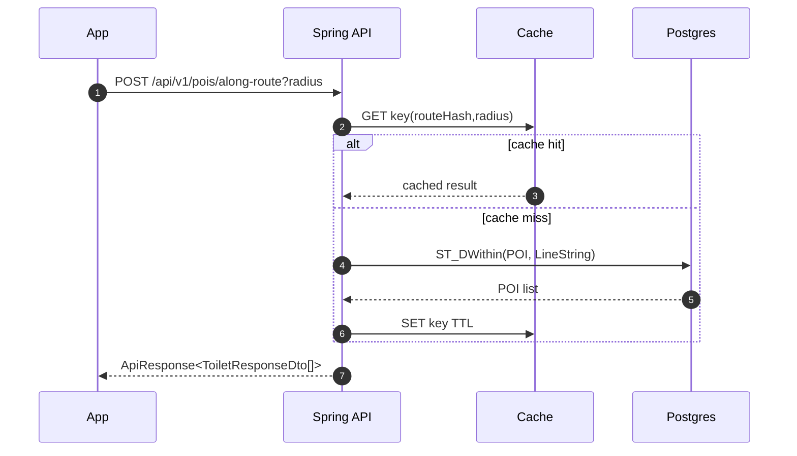
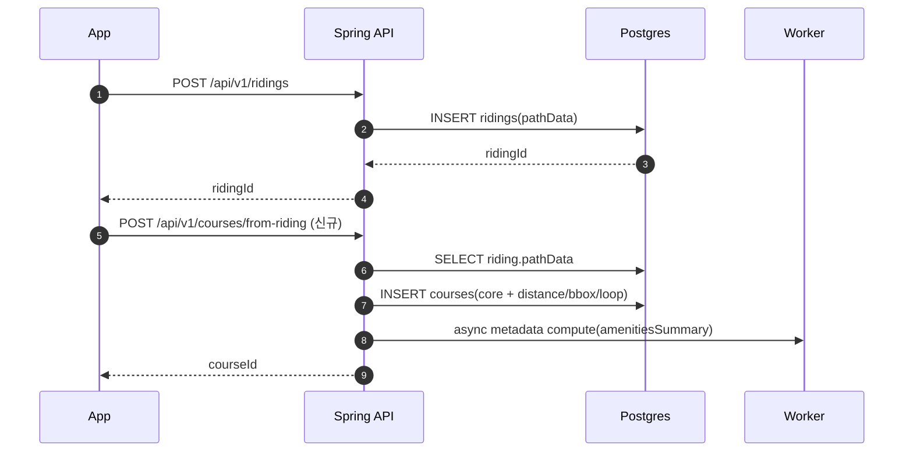
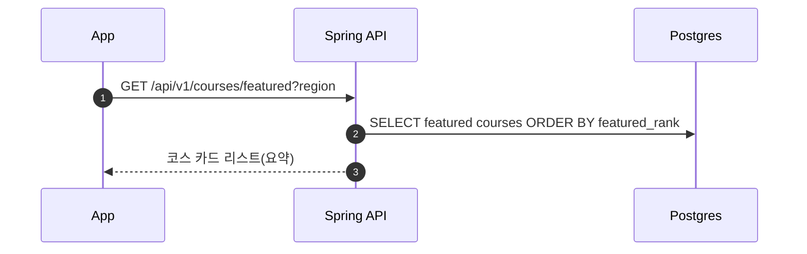
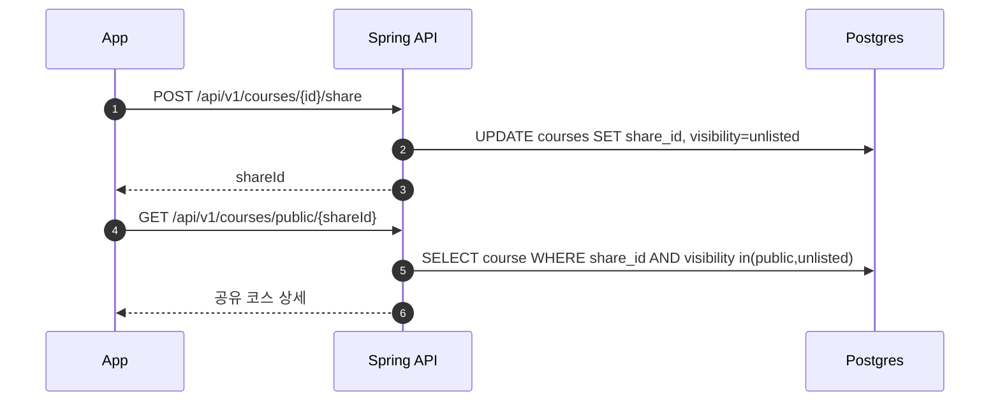

# 아키텍처 & 런타임 플로우

- 문서 ID: ARCH
- 버전: v0.1
- 작성일: 2026-02-25
- 상태: 초안

목적:

- MVP를 "어떤 구성"으로 "어떤 흐름"으로 구현할지 고정한다.
- 성능/비용/프라이버시 리스크를 사전에 줄인다.

참조:

- `설계/02_MVP_요구사항정의서.md`
- `설계/03_기능_비기능_요구사항명세서.md`
- `설계/10_데이터모델_스키마.md`
- `설계/11_API_명세.md`

## 1. 시스템 구성(논리)

```mermaid
flowchart LR
  RN[React Native App]
  API[Spring Boot API]
  DB[(Postgres + PostGIS)]
  Cache[(Cache: In-memory/Redis)]
  Worker[Scheduler/Worker]
  ExtPOI[External POI API]
  AI[LLM Provider (vNext)]

  RN -->|HTTPS JSON| API
  API --> DB
  API --> Cache
  Worker --> DB
  Worker --> ExtPOI
  API --> ExtPOI
  RN --> AI
  API --> AI
```

MVP 원칙:

- 외부 POI API는 "런타임 사용자 요청"에서 제거하고, 동기화 후 DB로 서빙한다.
- 코스 따라가기(레벨 2)는 클라이언트 계산(진행률/이탈), 서버는 데이터 제공.
- 코스 메타데이터 파생치(거리/bbox/POI 요약)는 서버가 산출하되, 무거운 계산은 비동기로 분리.

## 2. 런타임 플로우(핵심 시나리오)

### 2.1 POI 동기화(전체/증분)

목표: 공공화장실 데이터를 안정적으로 적재하고, 조회는 DB로 처리한다.



구현 메모:

- 현재 코드에는 full refresh(deleteAllInBatch) + incremental(bulk 조회 + saveAll)이 존재한다.
- 동기화 실패는 사용자 조회를 막지 않게 한다(마지막 성공 데이터로 서빙).

### 2.2 내 주변 POI 조회(nearby)



성능 포인트:

- `pois.location`에 GiST 인덱스 필요.
- radius 기본값은 UI/밀도에 따라 조정(500m는 시작점).

### 2.3 경로 주변 POI 조회(along-route)



키 설계(초안):

- routeHash = 좌표 리스트를 normalize(소수점 자리/샘플링) 후 해시
- key 예: `alongRoute:toilet:{routeHash}:{radius}`

### 2.4 라이딩 저장 -> 코스 생성(UGC)



메타데이터 산출 책임:

- 동기(요청 응답 안에서): distance/bbox/loop
- 비동기(워커): toilet_count/cafe_count, maxGap 같은 요약

API 계약(중요):

- 비동기 파생치가 아직 계산 전이면 코스 상세 응답에서 `amenitiesSummary: null`을 반환한다.
- UI는 `null`을 "계산 중"으로 처리하고, 이후 재조회/캐시 TTL로 최신화한다.

### 2.5 기본 제공 코스(피처드) 노출



### 2.6 코스 공유



## 3. 가이드(레벨 2) 계산(클라이언트)

핵심: 클라이언트에서 "내 위치"와 "코스 선"의 관계를 계산해 진행률/이탈을 표시.

### 3.1 진행률 계산(초안)

- 입력: 코스 polyline(좌표 리스트), 현재 위치
- 출력: (a) 현재 위치에 가장 가까운 선분의 projection point, (b) 누적거리 기준 진행률

권장 접근(정확도/성능 균형):

- polyline을 segment로 나눈 후, 현재 위치와의 최소 거리 선분을 찾는다.
- projection을 통해 "코스 상의 현재 지점"을 결정한다.
- 그 지점까지의 누적 거리 / 전체 거리 = progress.

성능 팁:

- polyline이 길어지면 간격 샘플링/단순화 적용
- 최근 선분 주변만 탐색(이동 연속성 이용)

### 3.2 이탈/복귀(히스테리시스)

- 기본값(정책 문서 참조): 이탈 30m 초과, 복귀 15m 이하
- 최소 유지시간(예: 3초)으로 상태 깜빡임 방지

## 4. 캐시/프리컴퓨트 전략

### 4.1 캐시 대상

- along-route POI 결과
- 코스 상세 요약(특히 amenitiesSummary)
- featured 코스 리스트(짧은 TTL)

### 4.2 캐시 구현 옵션

- 단일 인스턴스 MVP: in-memory(Caffeine)로 시작
- 멀티 인스턴스/확장: Redis로 전환

### 4.3 프리컴퓨트(권장)

- 코스 생성 시 기본 파생치(distance/bbox/loop)를 저장
- POI 요약은 워커가 계산해 courses 테이블에 저장
- 조회는 저장된 요약을 그대로 읽고, 필요 시 캐시로 보강

## 5. 비동기 작업(워커/스케줄러)

MVP 구현 후보:

- Spring `@Scheduled` + (선택) `@Async` 워커

작업 목록:

- POI 증분 동기화(일 1회)
- featured/최근 코스 메타데이터 재계산
- (추후) 오래된 위치 데이터 삭제(retention)

## 6. 보안/프라이버시(요약)

- MVP는 인증을 단순화해도, 위치/경로는 민감 데이터로 취급한다.
- 공유 코스는 기본 unlisted, 출발지 정확도 노출은 최소화한다.
- 로그에는 원본 위경도를 남기지 않는다(마스킹/샘플링).

상세 정책:

- `설계/04_정책정의서.md`
