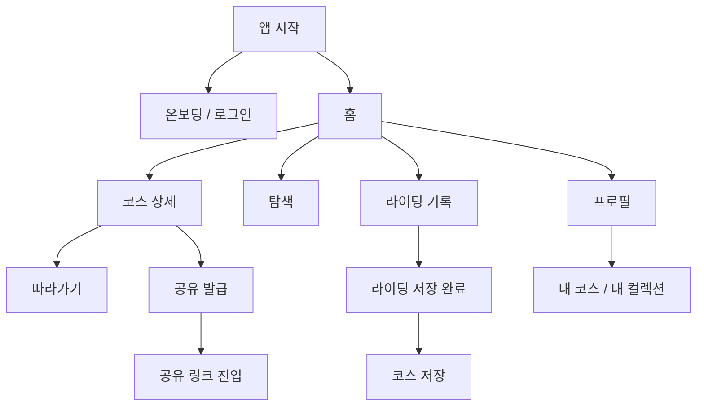

# 화면 설계 구조도

- 문서 ID: SCREEN-IA
- 버전: v1.0
- 작성일: 2026-03-11
- 상태: 활성

목적:

- 제품의 1차 사용 채널인 모바일 화면 구조와 현재 저장소 웹 라우트를 한 장에서 대응시킨다.
- 구현 전에 "어떤 화면이 어떤 유스케이스를 책임지는가"를 먼저 잠근다.

관련 문서:

- `docs/01_MVP1_제품요구사항.md`
- `docs/02_사용자흐름.md`
- `설계/29_프론트엔드_개발_가이드.md`
- `설계/35_모바일_클라이언트_개발_가이드.md`

---

## 1. 모바일 기준 정보구조

핵심 원칙:

- 홈에서 코스 상세로 가는 경로가 가장 짧아야 한다.
- 코스 상세의 1차 CTA는 `따라가기`, 2차 CTA는 `공유`, 3차 CTA는 `저장/컬렉션`이다.
- 라이딩 기록은 독립 탭 또는 하단 주요 진입점으로 둔다.

---

## 2. MVP1 모바일 화면 목록

| 화면 ID | 화면명 | 핵심 목적 | MVP1 여부 |
|---|---|---|---|
| SCR-M-001 | 스플래시/세션확인 | 토큰 재검증, 최초 라우팅 결정 | 필수 |
| SCR-M-002 | 로그인 | 카카오 로그인 시작 | 필수 |
| SCR-M-003 | 홈 | featured 코스, 주변 화장실 | 필수 |
| SCR-M-004 | 코스 상세 | 코스 메타, 경고, 하이라이트, CTA | 필수 |
| SCR-M-005 | 따라가기 | L2 진행률, 이탈 안내, 현재 위치 | 필수 |
| SCR-M-006 | 라이딩 기록 | 기록 시작/일시정지/종료 | 필수 |
| SCR-M-007 | 라이딩 저장 완료 | 저장 결과와 코스 생성 유도 | 필수 |
| SCR-M-008 | 공유 코스 열람 | share link 진입 | 필수 |
| SCR-M-009 | 프로필 | 로그인 상태, 내 활동 | 필수 |
| SCR-M-010 | 내 코스 목록 | 내가 저장한 코스 | 후속 |
| SCR-M-011 | 컬렉션 상세 | 여행 컬렉션 열람 | 후속 |
| SCR-M-012 | 코스모임 | 모임 생성/참가 | 후속 |

---

## 3. 현재 저장소 웹 라우트 대응

| 모바일 화면 | 현재 웹 라우트 | 비고 |
|---|---|---|
| SCR-M-002 로그인 | `/profile` + `/auth/kakao/*` | 현재 웹은 프로필 화면에서 로그인 진입 |
| SCR-M-003 홈 | `/` | featured + nearby |
| SCR-M-004 코스 상세 | `/course/[id]` | 현재 구현체 존재 |
| SCR-M-005 따라가기 | `/course/[id]/guide` | 웹은 브라우저 GPS 기반 |
| SCR-M-006 라이딩 기록 | `/ride` | 웹은 브라우저 기록 흐름 |
| SCR-M-008 공유 코스 열람 | `/share/[shareId]` | 현재 구현체 존재 |
| SCR-M-009 프로필 | `/profile` | 현재 구현체 존재 |
| SCR-M-011 컬렉션 상세 | `/collections/[collectionId]` | 확장 구현 |
| SCR-M-012 코스모임/채팅 | `/meetups/[meetupId]/chat` | 확장 구현 |

---

## 4. 핵심 화면별 상태 설계

### 4-1. 홈

- 기본 상태:
  - 로딩
  - featured 로드 성공
  - 위치 권한 허용
  - 위치 권한 거부
  - featured API 실패 fallback
- 절대 규칙:
  - 위치 권한이 없어도 홈은 사용 가능해야 한다.
  - featured 실패가 앱 전체 오류로 번지면 안 된다.

### 4-2. 코스 상세

- 기본 상태:
  - 로딩
  - 정상 조회
  - 코스 없음
  - 공유 불가
  - 공유 가능
- 절대 규칙:
  - 상세의 1차 CTA는 항상 따라가기다.
  - 부가 정보 실패가 메인 path 렌더링을 막지 않는다.

### 4-3. 따라가기

- 기본 상태:
  - 준비중
  - 재생중
  - 일시정지
  - 이탈 안내
  - 종료
  - 위치 권한 거부
- 절대 규칙:
  - 코스 정보는 위치 획득 전에도 먼저 보여준다.
  - 이탈은 오류가 아니라 가이드 상태다.

### 4-4. 라이딩 기록

- 기본 상태:
  - idle
  - recording
  - paused
  - saving
  - saved
  - error
- 절대 규칙:
  - 기록 권한이 없으면 저장 CTA를 비활성화한다.
  - 저장 후에는 코스 저장 CTA를 즉시 보여준다.

---

## 5. 화면별 1차 CTA 우선순위

| 화면 | 1차 CTA | 2차 CTA | 3차 CTA |
|---|---|---|---|
| 홈 | 코스 상세 진입 | 위치 권한 허용 | 탐색 |
| 코스 상세 | 따라가기 | 공유 링크 발급 | 컬렉션 추가 |
| 따라가기 | 시작/재개 | 일시정지 | 종료 |
| 라이딩 기록 | 기록 시작 | 일시정지 | 종료/저장 |
| 공유 코스 열람 | 코스 열기 | GPX 열람 | 홈 이동 |

---

## 6. 산출물 원칙

- 화면 설계서가 바뀌면 최소한 다음 문서가 함께 바뀌어야 한다.
  - `docs/02_사용자흐름.md`
  - `설계/35_모바일_클라이언트_개발_가이드.md`
  - 필요 시 `설계/29_프론트엔드_개발_가이드.md`
- 새 화면을 추가할 때는 `화면 ID`, `핵심 목적`, `진입 경로`, `1차 CTA`를 함께 정의한다.
